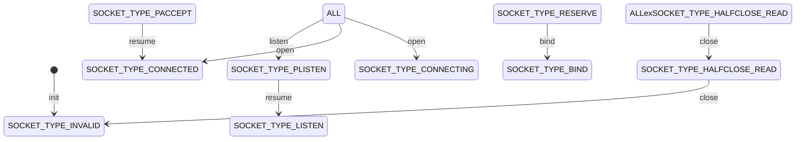

# skynet_main.c
skynet 的程序入口`skynet_main.c` 中.

## skynet_globalinit()
`skynet_globalinit()` 方法进行了当前节点的初始化, 节点的内存结构如下:

``` c
struct skynet_node {
	ATOM_INT total; //Todo: 不知道干啥的
	int init; //初始化是否已完成(猜测不用bool是因为部分平台不支持?)
	uint32_t monitor_exit; //Todo: 不知道干啥的
	pthread_key_t handle_key; //threadLocal 记录本线程类型的 key
	bool profile;	// default is on
};
```

### 扩展阅读 - pthread.h 
> 
其中 `pthread_key_t` 来自 linux 的 `pthread` 库, 该库提供了常见的线程操作. 这里用到了类似 > ThreadLocal 的线程内变量的功能(在不同线程中名称相同, 但内容各自独立的变量):
> - `pthread_key_create()` 创建一个绑定于当前线程的全局变量
>     - @param `pthread_key_t *` 该变量的 key
>     - @param `void (* _Nullable)(void *)` 变量销毁时的析构函数
> - `pthread_setspecific()` 设置变量的值
>     - @param `pthread_key_t`: 该变量的 key
>     - @param `const void * _Nullable`: 该变量的 value
> - `pthread_getspecific()`
>     - @param `pthread_key_t`: 该变量的 key
>     - @return `* _Nullable`: 该变量的 value
> - `pthread_key_delete()` 删除该变量, 并触发其析构函数
>     - @param `pthread_key_t`: 该变量的 key

## skynet_env_init()
`skynet_env_init()` 方法设置了当前 skynet 服务的环境, 该环境结构如下:
```c 
struct skynet_env {
	struct spinlock lock; //自旋锁
	lua_State *L; //lua虚拟机
};
```
在进行环境初始化时, 首先为该结构分配了内存空间, 然后创建了新的 lua 虚拟机作为 L 的值.

## sigign()
`sigign()` 方法生成了一个用于忽略某信号的 `sigaction`, 并将其绑定到管道信号 `SIGPIPE` 上.

### 扩展阅读 - signal.h
> `sigaction()` 来自 c 标准库, 接收一个信号类型枚举和一个用以处理该信号的方法 `sa_handler`. 此处使用的 `SIG_IGN` 是标准库提供的默认处理方法之一, 用以忽略对某一信号的处理.

## 配置加载
使用 lua 代码加载启动参数中指定的配置文件, 并将信息写入提前声明的 c 结构 `config` 中.
> skynet 的配置结构请参考: https://github.com/cloudwu/skynet/wiki/Config

### 扩展阅读 - lua
> `luaL_newstate()` 创建一个新的 lua 虚拟机环境.
> `luaL_openlibs(L)` 将 lua 标准库加载入该环境中.
> `luaL_loadbufferx()` 将一段指定的 lua 代码压入栈顶
> `lua_pushstring()` 将一段字符串压入栈顶, 此处是上述代码段中要使用的参数.
> `lua_pcall()` 调用之前压入的 lua 代码段

## _init_env()
加载配置到 lua 虚拟机后, 用该虚拟机进行 skynet 环境的初始化. 如前文所说, skynet 环境的主体也是一个 lua 虚拟机, 这里做的工作本质上其实是将配置文件中的键值对作为全局变量, 加载到这个 lua 虚拟机中.

### 扩展阅读 - lua
> 在加载过程中, 有两处经典的 lua 用法:
>
> 一处是在加载配置文件时, 使用了 `luaL_loadbufferx` 将字符串形式的 lua 代码加载到 lua 虚拟机中, 然后使用 `lua_pcall` 来调用这段代码:
> ```c
> 	int err =  luaL_loadbufferx(L, load_config, strlen(load_config), "=[skynet config]", "t");
>	assert(err == LUA_OK);
>	lua_pushstring(L, config_file);
>
>	err = lua_pcall(L, 1, 1, 0);
>```
> 
> 另一处是在 `_init_env` 中进行的经典的遍历 lua 表的操作:
> ```c
> lua_pushnil(L);  /* first key */
> while (lua_next(L, -2) != 0) {
> 	int keyt = lua_type(L, -2);
> 	const char * value = lua_tostring(L,-1);
> 	lua_pop(L,1);
> }
> lua_pop(L,1);
>```
> 这里 `lua_next` 的作用是从虚拟机栈顶部弹出一个元素, 然后把索引指向的表中的一个键值对弹出, 并分别压入虚拟机栈顶部(先压入键后压入值), 如果目标表已无任何元素, 则返回 `0`.

## skynet_start()
初始化日志
- 注册SIGHUP信号
初始化为守护线程
- 启动守护线程
- 记录pid
- 重定向标准输入输出到空文件(/dev/null)

## skynet socket 生命周期
skynet 的 socket 状态存储于 socket 结构的 type 字段, 是一个原子整型变量. 它代表了该 socket 当前的生命周期状态. 本节着重讲解 socket 的生命周期是如何进行流转的.



### socket 状态解析
- SOCKET_TYPE_INVALID
    - socket 初始化后的状态
- SOCKET_TYPE_RESERVE
- SOCKET_TYPE_PLISTEN
- SOCKET_TYPE_LISTEN
- SOCKET_TYPE_CONNECTING
- SOCKET_TYPE_CONNECTED
- SOCKET_TYPE_HALFCLOSE_READ
- SOCKET_TYPE_HALFCLOSE_WRITE
- SOCKET_TYPE_PACCEPT
- SOCKET_TYPE_BIND
    - socket 绑定后的状态

### socket 操作解析
- resume
    - 启用 socket 的读操作
- pause
    - 关闭 socket 的读操作
- bind
    - 